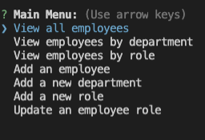
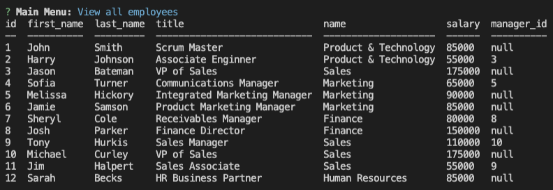
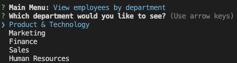

# Employee Tracker

  ## Description 
  
  This appplication is a CLI to help track and document employees within an organization. The application allows users to create employees, add a salary for that employee, assign them a specific role and manager. Each role is tied to a specific department so you are able to view employees within a given department and calculate their salary expenses, etc. 
  
  
  ## Table of Contents (Optional)
  
  * [Installation](#installation)
  * [Usage](#usage)
  
  
  ## Installation
  
  The npm packages that are needed for this application are mysql, inquirer and console.table. In addition to these packages, use the schema and seeds file to create the initial database. 
  
  
  ## Usage 
  
  Start the application within the command line using node. The user will be prompted to select a function from the main menu for the application to perform and it will respond accordingly. 
  
  
  ## Badges
  
  
  
  
  ## Contributing
  
  Kieran Lynch
  

  ## Tests
  
  None at this time
  
  ## Screenshots:
  
  Main menu:

  

  I used the console.table package to display the table within the terminal:

  

  When a user selects an option, they are presented with further conditions to drill down into what they want to see:

  